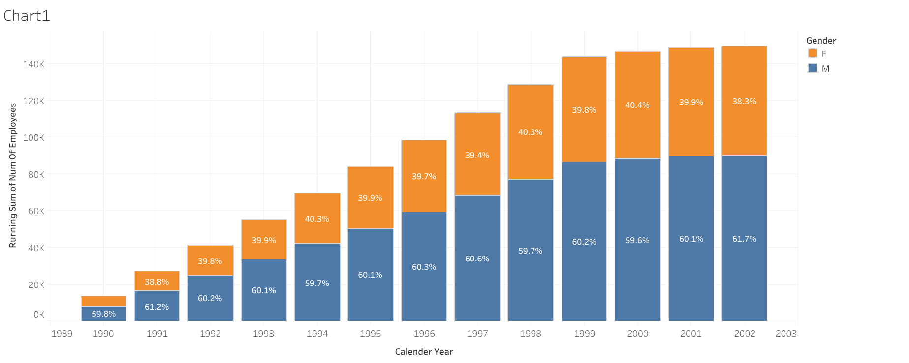
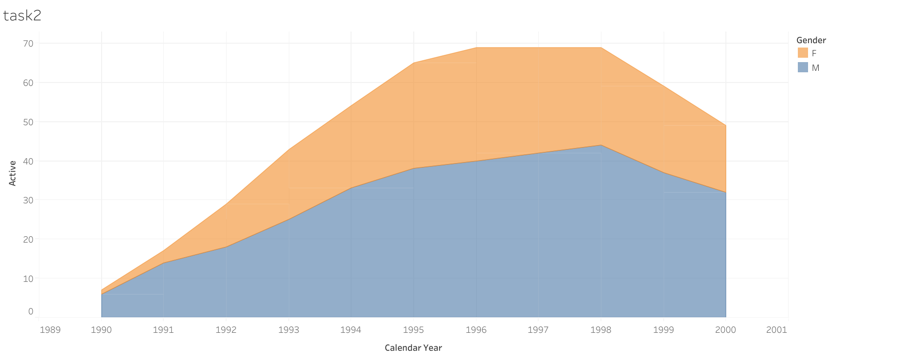
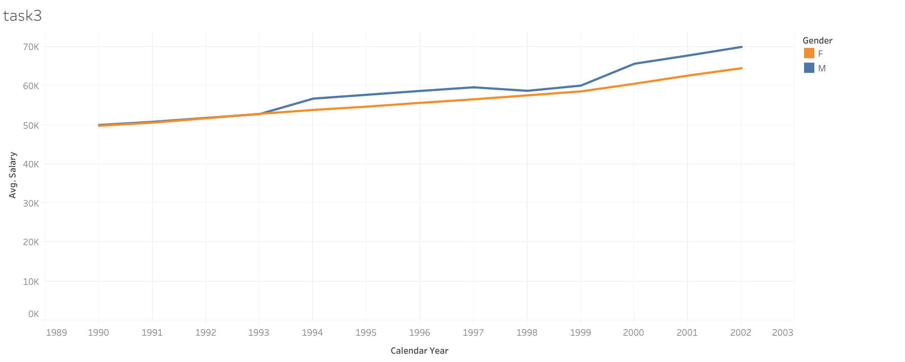
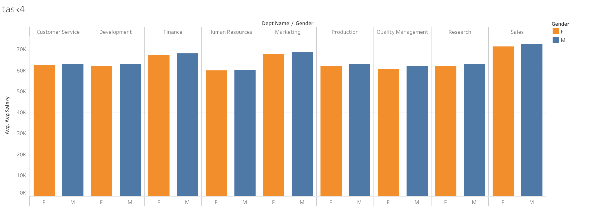

# SQL Exercises & Tableau Visualizations

## Course Information
This repository contains exercises and visualizations from the course **"SQL - MySQL for Data Analytics and Business Intelligence"** on Udemy, created by  [365 Careers, 365 Team]. 

## Database Overview
The exercises are based on the **Employee Database**, which includes the following tables:
- `t_employees`: Employee details (name, gender, hire date).
- `t_departments`: Lists of department names and numbers.
- `t_dept_emp`: Employee-department relationships.
- `t_dept_manager`: Department managers' details.
- `t_salaries`: Salary information for employees.

## Tasks Overview

### Task 1
**SQL Task**: Create a visualization that provides a breakdown between the male and female employees working in the company each year, starting from 1990.

[View my Tableau Visualization](https://public.tableau.com/app/profile/vasileia.vagena/viz/Book1_17284060097710/Chart1)

### Task 1.a
**SQL Task**: Find the number of female employees who signed contracts before January 1, 1998, and the number of male employees who signed contracts in the same period.

### Task 2
**SQL Task**: Compare the number of male managers to female managers across departments for each year starting from 1990.

[View my Tableau Visualization](https://public.tableau.com/app/profile/vasileia.vagena/viz/Book2task2_17284775262390/task2)

### Task 3
**SQL Task**: Compare the average salary of female versus male employees across all departments up to 2002.

[View my Tableau Visualization](https://public.tableau.com/app/profile/vasileia.vagena/viz/Book3task3/task3)

### Task 3.a
**SQL Task**: Filter the comparison of average salaries by contract dates (before or on/after January 1, 1998).

### Task 4
**SQL Task**: Create a stored procedure that retrieves the average salary of male and female employees within a user-defined salary range per department.

[View my Tableau Visualization](https://public.tableau.com/app/profile/vasileia.vagena/viz/Book4_17290744380270/task4)

### Task 5
**Tableau Task**: Organize visualizations from tasks 1-4 into a Tableau dashboard.

[View my Tableau Visualization](https://public.tableau.com/app/profile/vasileia.vagena/viz/Book4task5_dashboard/Dashboard1?publish=yes)

## Acknowledgments
This repository includes exercises and visualizations from the course **"SQL - MySQL for Data Analytics and Business Intelligence"** on Udemy. Special thanks to [365 Careers, 365 Team] for the insightful content.

---

